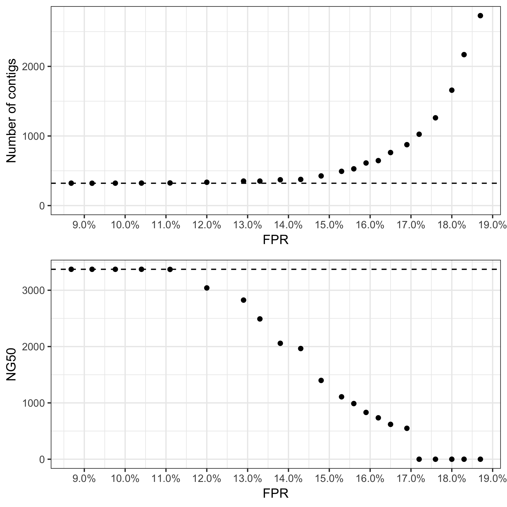

# Effect of Bloom filter false positive rate on assembly with ABySS

# Results

Assembly performance is unaffected so long as the FPR is below 11%. We see degraded assembly performance with FPR between 11% and 17%, and severely degraded assembly performance above 17% (Fig. 1). This result is consistent with Pell *et al.* (2012), who predict that the graph structure will degrade quickly with a FPR above 18.3%.

Fig. 1: Assembly performance is degraded when the FPR is above 11%, and severely degraded above 17%.

| FPR   | Contigs | NG50 (bp) |
|------:|--------:|----------:|
|  8.7% |     322 |     3,372 |
|  9.2% |     321 |     3,372 |
|  9.8% |     322 |     3,372 |
| 10.4% |     323 |     3,372 |
| 11.1% |     325 |     3,370 |
| 12.0% |     335 |     3,041 |
| 12.9% |     352 |     2,825 |
| 13.3% |     352 |     2,491 |
| 13.8% |     371 |     2,058 |
| 14.3% |     376 |     1,965 |
| 14.8% |     426 |     1,399 |
| 15.3% |     492 |     1,108 |
| 15.6% |     528 |       988 |
| 15.9% |     612 |       831 |
| 16.2% |     646 |       735 |
| 16.5% |     762 |       619 |
| 16.9% |     875 |       549 |
| 17.2% |   1,025 |         0 |
| 17.6% |   1,261 |         0 |
| 18.0% |   1,658 |         0 |
| 18.3% |   2,169 |         0 |
| 18.7% |   2,729 |         0 |

# Methods

- ABySS 2.1.4
- [Makefile](Makefile)
- [Sequencing data](https://github.com/rrwick/Unicycler/tree/master/sample_data#shigella-sonnei-plasmids-synthetic-reads)
